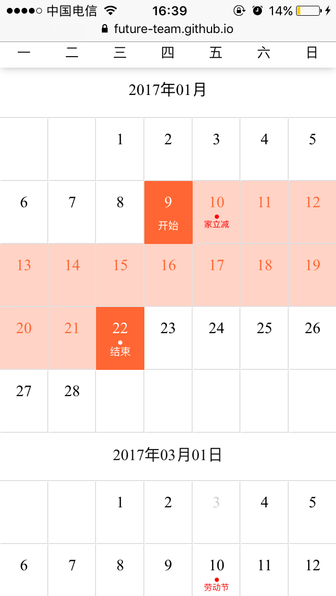

# ph-calendar
calendar component for phoenix-ui

# Install
```javascript
$ npm install ph-calendar --save 
```
# Usage

```javascript
import React, {Component, PropTypes} from 'react'
import PhCalendar from 'ph-calendar'

class Demo extends Component {
    constructor(props, context) {
        super(props, context)
            this.state = {
                values: [new Date(2017, 1, 24), new Date(2017, 2, 10)],
                disabled:[new Date(2017, 2, 14), new Date(2017, 2, 17)],// start end 包括
                weekStart: 1,
                monthCount: 5,
                range: true,
                //weekLabel: ['Sun', 'Mon', 'Tue', 'Wed', 'Thu', 'Fri', 'Sat'],
                events: [
                    {
                        date: new Date(2017, 1, 10),
                        name: '家立减'
                    },
                    {
                        date: new Date(2017, 1, 22),
                        name: '团购'
                    },
                    {
                        date: new Date(2017, 2, 10),
                        name: '劳动节'
                    },
                    {
                        date: new Date(2017, 2, 15),
                        name: '哈哈哈'
                    }
                ]
            }
    }
    chooseCallback(data){
        console.log('选择后的日期', data)
    }
    render() {
        const {values, disabled, weekStart, events, weekLabel, range, monthCount} = this.state
        return (
            <div className="rcs-demo">
                <PhCalendar 
                    values={values}
                    dateChose={this.chooseCallback}
                    disabled={disabled}
                    events={events}
                    monthCount={monthCount}
                    weekStart={weekStart}
                    weekLabel={weekLabel}
                    range={range}/>
            </div>
        )
    }
}
```

# Options

支持的属性配置：
- `values` : 日期对象数组，设置日历的选中日期，默认为空数组。 eg: 时间范围：`[new Date(2017, 1, 24), new Date(2017, 2, 10)]`    
- `disabled` ：日期对象数组，设置禁用的日期，默认为空数组。 如果设置的值恰好为 2 个，则表示禁用的是一段日期。传如一个或者三个以上，则表示为单个日期禁用    
- `dateChose` ：日期选择回调函数，默认为空函数。单个日期模式下，选中一个日期则处罚；日期范围模式下，选中两个日期才触发     
- `range`：布尔值，设置日历选择日期的模式，默认为 `true`。 `true` 表示范围选择，`false` 表示单选
- `monthCount`：正整数，设置单页日历的个数，默认为 6。最小值为 3，最大值为 12
- `weekStart`：非负整数，设置一周的开始时间，默认为 1。取值范围是 `new Date().getDay()` 值的集合，即为 0、 1、 2、 3、 4、 5、 6，分别表示周日、周一、周二、周三、周四、周五、周六
- `weekLabel`：字符串数组，设置周的显示格式，默认为 ['日', '一', '二', '三', '四', '五', '六']
- `format`：字符串，设置日期的显示格式，默认为 `yyyy-MM-dd`
- `events`：对象数组，设置日历事件显示，默认为空数组。对象的格式为 `{'date': [Date Object], 'name': [String Object]}`,eg： `[{'date': new Date(2016, 4, 1), 'name': '劳动节'}]`
- `monthStart`：字符串，设置日历的默认显示方式，默认为 `top`。可选值为`['top', 'center', 'bottom']`, `top` 表示日历按照选中日期递增方式显示，`top` 表示日历按照选中日期两端延伸方式显示，`bottom` 表示日历按照选中日期递减方式显示，

# Example
效果图如下：    
      
在线效果请看 [ph-calendar](https://future-team.github.io/ph-calendar/examples/index.html)       
详细请参见`examples` 目录下 demo，更改对应参数查看效果，具体步骤参见下面 `Command`     

# Command
```bash
# clone 代码仓库
$ git clone https://github.com/future-team/ph-calendar.git && cd ph-calendar
# 安装依赖
$ npm install 
# 查看demo
$ npm run demo 
```
# Repair
- 0.1.0 第一版本发布